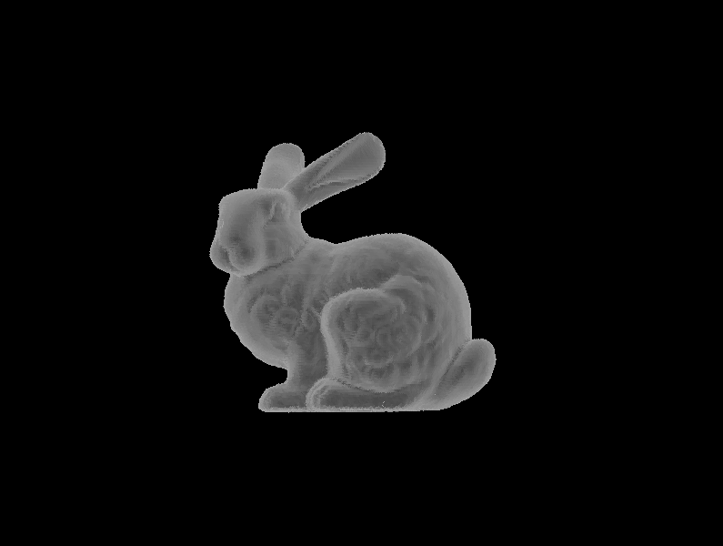

# 区间扫描线算法和z_buffer扫描线算法

本软件使用共享数据结构实现了区间扫描线算法和z_buffer扫描线算法，支持非凸多边形，并可显示扫描线算法执行时间。

## 开发环境

- 设备硬件：`Intel(R) Core(TM) i5-8600K CPU @ 3.60GHz`，16G内存。
- 系统及编译环境：`Ubuntu 18.04, g++ 7.5, cmake 3.10`
- 依赖库：`OpenCV 3.2`（用于存储和显示图片）,` Eigen 3.2`（用于计算坐标变换、法向量等）, `yaml-cpp 0.5.2`（用于读取配置文件）。

## 运行方法

- 安装依赖环境，要求`Ubuntu > 18, OpenCV > 3, Eigen > 3, yaml-cpp, cmake > 2.8, g++ > 7.4`

  - `sudo apt install -y libeigen3-dev libopencv-dev libyaml-cpp-dev`
  - `sudo apt install cmake g++-7`

- 在本目录下编译运行

  - `mkdir build && cd build`
  - `cmake ..`
  - `make`

  - `./scanline`

- 配置obj文件路径、渲染方式、窗口大小以及调整模型位姿

  - 请修改`config`目录下的`config.yaml`文件，该文件主要的可配置项说明如下：

  ```yaml
  object_path: "../model/bunny.obj" #object file path
  width: 800  #width of window
  height: 600 #height of window
  render_mode: 0 #0 for interval scanline, 1 for z buffer scanline
  rotation_vector: [3.14, 0, 0] #original pose.
  ```
  
- 在运行可执行文件时，可通过`W, A, S, D, J, K`键调整模型位姿，使用`Q`键退出。

## 运行结果

- bunny模型



- non_convex模型


- through模型


- 在前述开发环境下，运行12个模型的时间如下，可见对大部分模型均能达到实时，在计时时只统计了两种算法各自的单独执行时间，并未统计显示模型时间。

| model number  | vertices | face  | time for interval scanline(ms) | time for z buffer scanlie(ms) |
| ------------- | -------- | ----- | ------------------------------ | ----------------------------- |
| bunny         | 34834    | 69451 | **37.5**                       | 37.78                         |
| venus         | 19755    | 43357 | 22.51                          | **18.25**                     |
| teapot_origin | 3644     | 6320  | 3.90                           | **3.60**                      |
| desk          | 3125     | 2438  | **1.60**                       | 1.75                          |
| cat           | 2755     | 5506  | **7.25**                       | 7.58                          |
| rose_vase     | 2184     | 3360  | 9.75                           | **5.35**                      |
| soccerball    | 1760     | 1992  | **3.15**                       | 3.72                          |
| dolphins      | 855      | 1692  | **2.00**                       | 2.14                          |
| teapot        | 530      | 992   | **1.23**                       | 1.43                          |
| cube          | 8        | 6     | **0.11**                       | 0.78                          |
| non_convex    | 8        | 1     | **0.09**                       | 0.54                          |
| through       | 6        | 2     | **0.06**                       | 0.20                          |

## 部分实现细节

本仓库使用了git记录了debug和profile的过程，可以通过git日志看到完成此次作业具体过程。

- 解析object file时为了尽可能减少string的拷贝构造并未使用C++的stream设施，而是使用C语言的标准输入输出自行实现对文本行的split功能，因此可以较快地parse object file, 并且几乎不存在多余的拷贝。为了验证parse效率，[对比了主要的几种split方法](https://github.com/JKTao/StringSplitTest)。
- 在实现active edge list的时候，一开始使用list存储active edge的智能指针，在profiler上发现这种做法极为低效。其中有两个问题，首先尽管智能指针的实现已经较为高效，但是频繁地拷贝带来引用计数的性能损耗仍然相当可观，换用普通指针后时间开销降低一半，二是STL库中list的sort方法远比泛型算法库中面向random access iterator的sort方法慢，并且存储指针还会带来间接引用的缓存不命中问题，最终直接使用vector存储active edge本身，对于频繁地插入插出经过上述改进，在venus上的时间损耗由60ms降到20ms. 
- scanline算法预先计算了dz_x, dz_y, dx等等比例，从而增量式更新扫描线与边的交点坐标和深度，其理论基础是一次加法比数次乘除法快。实际实现的时候为了保持接口的规整性，直接根据平面参数重新计算了深度，在profiler中发现更新坐标和深度的时间占比几乎为0，因此没有带来可见的性能开销。
- 由于模型文件被Windows上的软件打开过，其中包含一个回车符号，在parse时没有考虑这一点，导致了在Windows上测试和Ubuntu上测试效果完全不同，这一问题花费了较多时间解决。


